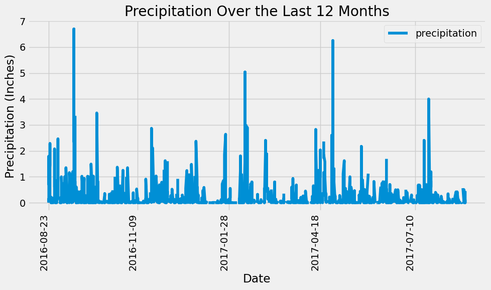
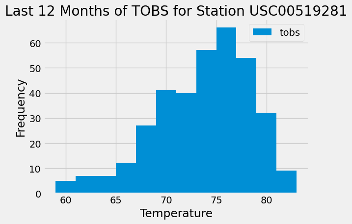

# Hawaii Climate Analysis and Data API

This project performs a climate analysis on Hawaii weather data, providing insights through exploratory data analysis and visualizations. The findings are accessible via a Flask web API.

## Project Structure

The project is organized as follows:

- `HawaiiAnalysis_API/`: 
  - `climate.ipynb`: A Jupyter Notebook containing the climate analysis and data visualizations. It includes detailed analysis of precipitation, temperature, and station data using SQLAlchemy to interact with the SQLite database. Visualizations are created using Matplotlib and Pandas.

  - `app.py`: A Flask application that provides a RESTful API to the climate data. This script makes the data available through various endpoints, allowing users to query precipitation, station, and temperature observation data.

- `HawaiiAnalysis_API/Resources/`: 
  - `hawaii.sqlite`: The SQLite database file containing the climate data for Hawaii. It includes tables for measurement and station data.


## Installation

To set up this project locally, follow these steps:

### Prerequisites

Ensure you have the following installed:

- Python 3.11 or higher
- pip (Python package manager)
- Jupyter Notebook or JupyterLab (for running the notebook)

### Clone the Repository

Start by cloning the repository to your local machine:

```bash
git clone https://github.com/NataliiaShevchenko620/sqlalchemy-challenge.git
cd sqlalchemy-challenge
```

## Requirements

This project requires the following Python packages:

- Flask: For creating and running the web API.
- SQLAlchemy: For database access and ORM capabilities.
- Pandas: For data manipulation and analysis.
- Matplotlib: For creating visualizations.
- NumPy: For numerical computations.

These dependencies can be installed using pip:

```bash
pip install Flask SQLAlchemy pandas matplotlib numpy
```

## Usage

This project is divided into two main parts: the climate analysis and the Flask API. Here's how to use each component:

### Climate Analysis in Jupyter Notebook

1. **Open the Notebook**:
    - Navigate to the project directory and launch Jupyter Notebook or JupyterLab:
      ```bash
      jupyter notebook
      # or
      jupyter lab
      ```
    - Open `climate.ipynb` from the Jupyter interface.

2. **Run the Analysis**:
    - Execute each cell in the notebook to perform the climate analysis and generate visualizations. 
    - The notebook is interactive, allowing you to modify parameters and re-run sections to explore different aspects of the data.
  
#### Exploratory Precipitation Analysis



#### Exploratory Station Analysis




### Using the Flask API

Once the Flask server is running, you can access the API endpoints to retrieve climate data:

1. **Start the Flask server**:
    - Run the following command in your terminal from the project directory:
      ```bash
      python app.py
      ```
    - The server will start on `http://localhost:5000`.

2. **Access API Endpoints**:
    - Use a web browser or a tool like `curl` or Postman to access the API endpoints.
    - Available endpoints:
        - `/`: Home page that lists all available routes.
        - `/api/v1.0/precipitation`: Fetches precipitation data for the last 12 months.
        - `/api/v1.0/stations`: Returns a list of weather stations.
        - `/api/v1.0/tobs`: Shows temperature observations for the most active station over the last year.
        - `/api/v1.0/<start>`: Retrieves min, avg, and max temperature from the start date onwards.
        - `/api/v1.0/<start>/<end>`: Retrieves min, avg, and max temperature for a specific date range.

Replace `<start>` and `<end>` with dates in `YYYY-MM-DD` format to query temperature data for a specific period.

### Examples

- To get precipitation data, visit `http://localhost:5000/api/v1.0/precipitation` in your web browser.
- To fetch temperature data from January 1, 2017, to January 1, 2018, use `http://localhost:5000/api/v1.0/2017-01-01/2018-01-01`.

This section provides clear instructions on how to interact with the project, both for running the climate analysis in the Jupyter Notebook and for querying data through the Flask API.

## License

This project is licensed under the MIT License - see the [LICENSE](LICENSE) file for details.


